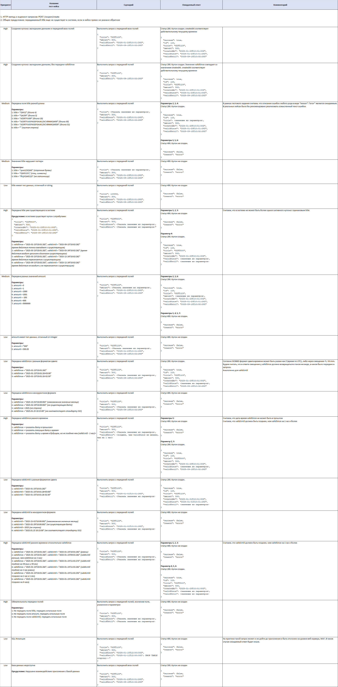

https://app.swaggerhub.com/apis/swagger-ba5/store/1.0.0#/Discounts/post_coupon_create

Необходимо составить полный набор тест-кейсов для проверки корректности работы только одного API-метода:
- POST /coupon/create
Если для выполнения задания вам требуется уточнить детали реализации (бизнес-логики) сервиса, то вы можете это сделать самостоятельно, отметив в столбце «Комментарий» свои варианты корректной реализации.
При решении данной задачи считаем, что мы не ограничены во времени и ресурсах. 
Также вы можете написать параметризованные тест-кейсы для уменьшения объема вводимых данных.

1. HTTP метод и эндпоинт запросов: POST /coupon/create 
2. Общее предусловие: передаваемый title еще не существует в системе, если в кейсе прямо не указано обратное

| Приоритет | Название тест-кейса                                                                                                                                                                                                                                                                                                                                                                                                                                                                                                                                                                                                                                                                                                                                                                                             | Сценарий                                                                                                                                                                                                                  | Ожидаемый ответ                                                                                                                                                                                                                                                                                                                                                       | Комментарий                                                                                                                                                                                                                                                      |
| --------- | --------------------------------------------------------------------------------------------------------------------------------------------------------------------------------------------------------------------------------------------------------------------------------------------------------------------------------------------------------------------------------------------------------------------------------------------------------------------------------------------------------------------------------------------------------------------------------------------------------------------------------------------------------------------------------------------------------------------------------------------------------------------------------------------------------------- | ------------------------------------------------------------------------------------------------------------------------------------------------------------------------------------------------------------------------- | --------------------------------------------------------------------------------------------------------------------------------------------------------------------------------------------------------------------------------------------------------------------------------------------------------------------------------------------------------------------- | ---------------------------------------------------------------------------------------------------------------------------------------------------------------------------------------------------------------------------------------------------------------- |
| High      | Создание купона с валидными данными и передачей всех полей                                                                                                                                                                                                                                                                                                                                                                                                                                                                                                                                                                                                                                                                                                                                                      | Выполнить запрос с передачей всех полей   {    "title": "GIFT123",   "amount": 500,   "validSince": "2025-01-23T10:01:28Z",   "validUntil": "2025-09-15T10:02:28Z" }                                                      | Статус 200. Купон создан. createdAt соответствует действительному текущему времени  {   "success": true,   "id": 123,   "title": "GIFT123",   "amount": 500,   "createdAt": "2025-01-23T10:01:00Z",   "validSince": "2025-01-23T10:01:28Z",   "validUntil": "2025-09-15T10:02:28Z" }                                                                                  |                                                                                                                                                                                                                                                                  |
| High      | Создание купона с валидными данными, без передачи validSince                                                                                                                                                                                                                                                                                                                                                                                                                                                                                                                                                                                                                                                                                                                                                    | Выполнить запрос с передачей полей   {    "title": "GIFT123",   "amount": 500,   "validUntil": "2025-09-15T10:02:28Z" }                                                                                                   | Статус 200. Купон создан. Значение validSince совпадает со значением createdAt. createdAt соответствует действительному текущему времени  {   "success": true,   "id": 123,   "title": "GIFT123",   "amount": 500,   "createdAt": "2025-01-23T10:01:00Z",   "validSince": "2025-01-23T10:01:00Z",   "validUntil": "2025-09-15T10:02:28Z" }                            |                                                                                                                                                                                                                                                                  |
| Medium    | Передача поля title разной длины  Параметры: 1. title = "QW12" (длина 4) 2. title = "QAZ09" (длина 5) 3. title = "AZERTYUI09" (длина 10) 4. title = "AZERTYUIOPASDFGHJKLZXCVBNMQW09" (длина 30) 5. title = "AZERTYUIOPASDFGHJKLZXCVBNMQWE09" (длина 31) 6. title = "" (пустая строка)                                                                                                                                                                                                                                                                                                                                                                                                                                                                                                                           | Выполнить запрос с передачей полей   {    "title": <Указать значение из параметров>,   "amount": 500,   "validSince": "2025-01-23T10:01:28Z",   "validUntil": "2025-09-15T10:02:28Z" }                                    | Параметры 2, 3, 4:  Статус 200. Купон создан.  {   "success": true,   "id": 123,   "title": <значение из параметров>,   "amount": 500,   "createdAt": "2025-01-23T10:01:00Z",   "validSince": "2025-01-23T10:01:28Z",   "validUntil": "2025-09-15T10:02:28Z" }  Параметры 1, 5, 6: Статус 400. Купон не создан.  {   "success": false,   "reason": "error" }          | В рамках тестового задания считаем, что описание ошибок любого рода в виде "reason": "error" является ожидаемым. В реальных кейсах было бы рекомендовано реализовать осмысленный текст ошибки и соответствующие http статусы                                     |
| Medium    | Значение title нарушает паттерн  Параметры: 1. title = "qwe123QWE" (строчные буквы) 2. title = "QWE123!;" (спец. символы) 3. title = "ЙЦУQWE123" (не латинница)                                                                                                                                                                                                                                                                                                                                                                                                                                                                                                                                                                                                                                                 | Выполнить запрос с передачей полей   {    "title": <Указать значение из параметров>,   "amount": 500,   "validSince": "2025-01-23T10:01:28Z",   "validUntil": "2025-09-15T10:02:28Z" }                                    | Статус 400. Купон не создан  {   "success": false,   "reason": "error" }                                                                                                                                                                                                                                                                                              |                                                                                                                                                                                                                                                                  |
| Low       | title имеет тип данных, отличный от string                                                                                                                                                                                                                                                                                                                                                                                                                                                                                                                                                                                                                                                                                                                                                                      | Выполнить запрос с передачей полей   {    "title": 123456,   "amount": 500,   "validSince": "2025-01-23T10:01:28Z",   "validUntil": "2025-09-15T10:02:28Z" }                                                              | Статус 400. Купон не создан  {   "success": false,   "reason": "error" }                                                                                                                                                                                                                                                                                              |                                                                                                                                                                                                                                                                  |
| High      | Передача title уже существующего в системе  Предусловие: в системе существует купон с атрибутами: {   "title": "GIFT500",   "amount": 500,   "createdAt": "2025-01-23T10:01:00Z",   "validSince": "2025-01-23T10:01:28Z",   "validUntil": "2025-09-15T10:02:28Z" }  Параметры: 1. validSince = "2025-01-23T10:01:28Z", validUntil = "2025-09-15T10:02:28Z" (время действия точно совпадает с существующим) 2. validSince = "2025-03-23T10:01:28Z", validUntil = "2025-03-24T10:02:28Z" (время действия входит целиком в диапазон существующего) 3. validSince = "2025-03-23T10:01:28Z", validUntil = "2025-12-24T10:02:28Z" (время действия пересекается с существующим) 4. validSince = "2025-09-15T10:02:29Z", validUntil = "2025-12-24T10:02:28Z" (время действия не входит и не пересекается с существущим) | Выполнить запрос с передачей полей   {    "title": "GIFT500",   "amount": 500,   "validSince": <Указать значение из параметров>,   "validUntil": <Указать значение из параметров>" }                                      | Параметры 1, 2, 3: Статус 400. Купон не создан  {   "success": false,   "reason": "error" }  Параметр 4: Статус 200. Купон создан.  {   "success": true,   "id": 123,   "title": "GIFT500",   "amount": 500,   "createdAt": "2025-01-23T10:01:00Z",   "validSince": <значение из параметров>,   "validUntil": <значение из параметров> }                              | Считаем, что в системе не может быть более одного активного купона с одинаковым title.                                                                                                                                                                           |
| Medium    | Передача разных значений amount  Параметры: 1. amount = 0 2. amount = 1 3. amount = 1000 4. amount = 1001 5. amount = -100 6. amount = 600 7. amount = 9999999                                                                                                                                                                                                                                                                                                                                                                                                                                                                                                                                                                                                                                                  | Выполнить запрос с передачей полей   {    "title": "GIFT123",   "amount": <Указать значение из параметров>,   "validSince": "2025-01-23T10:01:28Z",   "validUntil": "2025-09-15T10:02:28Z" }                              | Параметры 2, 3, 6:  Статус 200. Купон создан.  {   "success": true,   "id": 123,   "title": "GIFT123",   "amount": <значение из параметров>,   "createdAt": "2025-01-23T10:01:00Z",   "validSince": "2025-01-23T10:01:28Z",   "validUntil": "2025-09-15T10:02:28Z" }  Параметры 1, 4, 5, 7: Статус 400. Купон не создан.  {   "success": false,   "reason": "error" } |                                                                                                                                                                                                                                                                  |
| Low       | amount имеет тип данных, отличный от integer  Параметры: 1. amount = "500" 2. amount = 500.05                                                                                                                                                                                                                                                                                                                                                                                                                                                                                                                                                                                                                                                                                                                   | Выполнить запрос с передачей полей   {    "title": "GIFT123",   "amount": <Указать значение из параметров>,   "validSince": "2025-01-23T10:01:28Z",   "validUntil": "2025-09-15T10:02:28Z" }                              | Статус 400. Купон не создан  {   "success": false,   "reason": "error" }                                                                                                                                                                                                                                                                                              |                                                                                                                                                                                                                                                                  |
| Low       | Передача validSince с разным форматом сдвига  Параметры: 1. validSince = "2025-01-23T10:01:28Z" 2. validSince = "2025-01-23T10:01:28+03:00" 3. validSince = "2025-01-23T10:01:28-02:30"                                                                                                                                                                                                                                                                                                                                                                                                                                                                                                                                                                                                                         | Выполнить запрос с передачей полей   {    "title": "GIFT123",   "amount": 500,   "validSince": <Указать значение из параметров>,   "validUntil": "2025-09-15T10:02:28Z" }                                                 | Статус 200. Купон создан.  {   "success": true,   "id": 123,   "title": "GIFT123",   "amount": 500,   "createdAt": "2025-01-23T10:01:00Z",   "validSince": <значение из параметров>,   "validUntil": "2025-09-15T10:02:28Z" }                                                                                                                                         | Согласно ISO8601 формат сдвига времени может быть указан как Z (время по UTC), либо через смещение +\- hh:mm. Будем считать, что в ответе смещение у validSince должно возвращаться в таком же виде, в каком было передано в запросе.  Аналогично для validUntil |
| Low       | Передача validSince в некорректном формате  Параметры: 1. validSince = "2025-23-01T10:00:00Z" (невозможное значение месяца) 2. validSince = "2025-02-29T10:00:00Z" (не существующая дата) 3. validSince = 2025 (не строка) 4. validSince = "2025.01.25 10:15:00" (не соответствует стандарту ISO)                                                                                                                                                                                                                                                                                                                                                                                                                                                                                                               | Выполнить запрос с передачей полей   {    "title": "GIFT123",   "amount": 500,   "validSince": <Указать значение из параметров>,   "validUntil": "2025-09-15T10:02:28Z" }                                                 | Статус 400. Купон не создан  {   "success": false,   "reason": "error" }                                                                                                                                                                                                                                                                                              |                                                                                                                                                                                                                                                                  |
| High      | Передача validSince разного времени  Параметры: 1. validSince = <указать дату в прошлом> 2. validSince = <указать текущие дату и время> 3. validSince = <указать дату и время в будущем, но не позднее чем (validUntil - 1 час)>                                                                                                                                                                                                                                                                                                                                                                                                                                                                                                                                                                                | Выполнить запрос с передачей полей   {    "title": "GIFT123",   "amount": 500,   "validSince": <Указать значение из параметров>,   "validUntil": <позднее, чем validSince не меннее, чем на 1 час> }                      | Параметры 1: Статус 400. Купон не создан  {   "success": false,   "reason": "error" }  Параметр 2, 3: Статус 200. Купон создан.  {   "success": true,   "id": 123,   "title": "GIFT500",   "amount": 500,   "createdAt": "2025-01-23T10:01:00Z",   "validSince": <значение из параметров>,   "validUntil": "2025-09-15T10:02:28Z" }                                   | Считаем, что дата-время validSince не может быть в прошлом Считаем, что validUntil должен быть позднее, чем validSince на 1 час и более                                                                                                                          |
| Low       | Передача validUntil с разным форматом сдвига  Параметры: 1. validUntil = "2025-01-23T10:01:28Z" 2. validUntil = "2025-01-23T10:01:28+03:00" 3. validUntil = "2025-01-23T10:01:28-02:30"                                                                                                                                                                                                                                                                                                                                                                                                                                                                                                                                                                                                                         | Выполнить запрос с передачей полей   {    "title": "GIFT123",   "amount": 500,   "validSince": "2025-01-01T10:01:28Z",   "validUntil": <Указать значение из параметров> }                                                 | Статус 200. Купон создан.  {   "success": true,   "id": 123,   "title": "GIFT123",   "amount": 500,   "createdAt": "2025-01-01T10:01:00Z",   "validSince": "2025-01-01T10:01:28Z",   "validUntil": <значение из параметров> }                                                                                                                                         |                                                                                                                                                                                                                                                                  |
| Low       | Передача validUntil в некорректном формате  Параметры: 1. validUntil = "2025-23-01T10:00:00Z" (невозможное значение месяца) 2. validUntil = "2025-02-29T10:00:00Z" (не существующая дата) 3. validUntil = 2025 (не строка) 4. validUntil = "2025.01.25 10:15:00" (не соответствует стандарту ISO)                                                                                                                                                                                                                                                                                                                                                                                                                                                                                                               | Выполнить запрос с передачей полей   {    "title": "GIFT123",   "amount": 500,   "validSince": "2025-01-01T10:01:28Z",   "validUntil": <Указать значение из параметров> }                                                 | Статус 400. Купон не создан  {   "success": false,   "reason": "error" }                                                                                                                                                                                                                                                                                              |                                                                                                                                                                                                                                                                  |
| High      | Передача validUntil разного времени относительно validSince  Параметры: 1. validSince = "2025-01-23T10:01:28Z", validUntil = "2025-01-23T10:01:28Z" (равны) 2. validSince = "2025-01-23T10:01:28Z", validUntil = "2025-01-23T09:01:28Z" (validUntil раньше, чем validSince на 1 час) 3. validSince = "2025-01-23T10:01:28Z", validUntil = "2025-01-23T11:01:27Z" (validUntil позднее на 59 мин и 59 сек) 4. validSince = "2025-01-23T10:01:28Z", validUntil = "2025-01-23T11:01:28Z" (validUntil позднее на 1 час ровно) 5. validSince = "2025-01-23T10:01:28Z", validUntil = "2025-01-23T11:01:29Z" (validUntil позднее на 1 час и 1 сек) 6. validSince = "2025-01-23T10:01:28Z", validUntil = "2025-01-23T14:01:28Z" (validUntil позднее на 4 часа)                                                           | Выполнить запрос с передачей полей   {    "title": "GIFT123",   "amount": 500,   "validSince": <Указать значение из параметров>,   "validUntil": <Указать значение из параметров> }                                       | Параметры 1, 2, 3: Статус 400. Купон не создан  {   "success": false,   "reason": "error" }  Параметр 4, 5, 6: Статус 200. Купон создан.  {   "success": true,   "id": 123,   "title": "GIFT500",   "amount": 500,   "createdAt": "2025-01-23T10:01:00Z",   "validSince": <значение из параметров>,   "validUntil": <значение из параметров> }                        | Считаем, что validUntil должен быть позднее, чем validSince на 1 час и более                                                                                                                                                                                     |
| High      | Обязательность передачи полей  Параметры: 1. Не передать поле title, передать остальные поля 2. Не передать поле amount, передать остальные поля 3. Не передать поле validUntil, передать остальные поля                                                                                                                                                                                                                                                                                                                                                                                                                                                                                                                                                                                                        | Выполнить запрос с передачей полей, исключив поле, указанное в параметрах  {    "title": "GIFT123",   "amount": 500,   "validSince": <Указать значение из параметров>,   "validUntil": <Указать значение из параметров> } | Статус 400. Купон не создан  {   "success": false,   "reason": "error" }                                                                                                                                                                                                                                                                                              |                                                                                                                                                                                                                                                                  |
| Low       | SQL Инъекция                                                                                                                                                                                                                                                                                                                                                                                                                                                                                                                                                                                                                                                                                                                                                                                                    | Выполнить запрос с передачей полей  {    "title": "GIFT123",   "amount": 500,   "validSince": "2025-01-10T12:00:00Z",   "validUntil": "2025-01-11T12:00:00Z'; DROP TABLE coupons;--" }                                    | Статус 400. Купон не создан  {   "success": false,   "reason": "error" }                                                                                                                                                                                                                                                                                              | На практике такой запрос может и не дойти до приложения и быть отклонен на уровне веб сервера, WAF. В таком случае ожидаемый ответ будет иным.                                                                                                                   |
| Low       | База данных недоступна  Предусловие: Нарушено взаимодействие приложения с базой данных                                                                                                                                                                                                                                                                                                                                                                                                                                                                                                                                                                                                                                                                                                                          | Выполнить запрос с передачей всех полей   {    "title": "GIFT123",   "amount": 500,   "validSince": "2025-01-23T10:01:28Z",   "validUntil": "2025-09-15T10:02:28Z" }                                                      | Статус 500. Купон не создан  {   "success": false,   "reason": "error" }                                                                                                                                                                                                                                                                                              |                                                                                                                                                                                                                                                                  |
|           |                                                                                                                                                                                                                                                                                                                                                                                                                                                                                                                                                                                                                                                                                                                                                                                                                 |                                                                                                                                                                                                                           |                                                                                                                                                                                                                                                                                                                                                                       |                                                                                                                                                                                                                                                                  |

